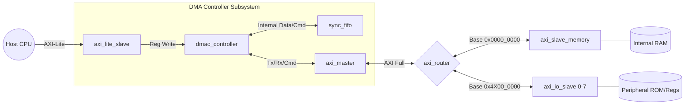

# Scatter-Gather DMA Controller

A high-performance Scatter-Gather Direct Memory Access (DMA) controller implemented in Verilog. This core utilizes the AMBA AXI protocol to autonomously transfer data between memory-mapped peripherals and standard memory without continuous CPU intervention. 

The controller leverages a linked-list descriptor fetching mechanism, allowing it to execute complex, non-contiguous memory transfers (scatter-gather) and features a built-in AXI router to map transactions across multiple memory and I/O slave devices.

---

## Key Features

*   **Scatter-Gather Operation:** Fetches transfer descriptors autonomously from memory via a linked-list structure.
*   **Standard AXI Interfaces:**
    *   **AXI Master:** Handles high-throughput data transfers and descriptor fetching.
    *   **AXI-Lite Slave:** Provides a lightweight interface for CPU configuration and control.
*   **Integrated AXI Router:** Routes transactions between the DMA Master and specific address spaces:
    *   `0x0000_0000`: Main Memory (Internal SRAM)
    *   `0x4X00_0000`: 8 independent I/O Slaves
*   **Robust Error Handling:** Detects and reports AXI Slave Errors (SLVERR), Decode Errors (DECERR), and Descriptor Ownership Errors directly back to the status word.
*   **Asynchronous Support Readiness:** Internal operations are buffered using a built-in synchronous FIFO, architected to allow easy decoupling into asynchronous clock domains if needed.

---

## Architecture Block Diagram

---

## Theory of Operation

### The DMA Pipeline
The controller operates using a pipeline structure to maximize transfer throughput, breaking operations into three concurrent stages:
1.  **Fetch Stage:** Reads the 24-byte descriptor from memory, pulling the source, destination, length, and configuration data into an internal queue. It uses the link pointer to queue the next fetch.
2.  **Dispatch/Issue Stage:** Issues an AXI Read (`AR`) to pull data from the source address into the internal FIFO, immediately followed by an AXI Write (`AW`) to push that data to the destination address.
3.  **Update/Commit Stage:** Waits for the AXI read and write responses (`R` and `B` channels). Once a transfer finishes, it updates the descriptor's status word in memory (handling any `SLVERR` or `DECERR` errors) and fires a CPU interrupt if it marks the end of a batch.

### AXI Implementation & Routing
Instead of relying on an external system interconnect, this project handles its own AXI traffic routing directly within the `dmac_top` module using three distinct AXI components:

*   **AXI-Lite Slave (`axi_lite_slave`):** Provides a simple, non-bursting interface for the host CPU. It decodes incoming CPU writes to map directly to the DMA's internal control registers (e.g., triggering the RUN bit or setting the initial descriptor pointer).
*   **AXI Full Master (`axi_master`):** Driven by the DMA controller, this module handles all heavy lifting. It translates the internal pipeline's fetch and dispatch commands into compliant AXI burst reads and writes to move descriptors and payloads.
*   **Custom AXI Router (`axi_router`):** This module acts as the traffic director for the Master. It decodes the top nibble (bits) of the Master's target address:
    *   If the address starts with `0x0`, it routes the `VALID`/`READY` handshakes to the internal SRAM block.
    *   If the address starts with `0x4`, it identifies the transaction as an I/O operation and uses bits to route the handshakes to one of the eight simulated peripheral slaves.

---

## Memory Map & Registers

The DMA controller is configured by the CPU via the AXI-Lite interface.

### Control Registers

| Offset | Register Name | Description |
|---|---|---|
| **0x00** | `CTRL_REG` | Write `1` to Bit 0 to start (RUN) the DMA engine. |
| **0x14** | `CURR_DESC_PTR` | Pointer to the first 32-bit address of the descriptor chain. |
| **0x18** | `IRQ_CLEAR` | Write `1` to Bit 0 to clear pending hardware interrupts and halt states. |

### Descriptor Format

Descriptors are 6 words (24 bytes) long and must be aligned in memory.

| Word Offset | Field | Description |
|---|---|---|
| **0x00** | Link Pointer | Address of the next descriptor. A value of `0x0000_0000` indicates the End of Chain (EOF). |
| **0x04** | Source Address | The address to read data from. |
| **0x08** | Dest Address | The address to write data to. |
| **0x0C** | Config & Length | Bits: Transfer Size. Bits [15:0]: Transfer Length in Bytes. |
| **0x10** | User / Reserved | Reserved for application-specific routing or metadata. |
| **0x14** | Status | Bit 0: Ownership (1 = CPU, 0 = DMA). Bits [4:1]: Error Codes (SLVERR, DECERR). |

---

## Simulation and Testing

The included testbench (`dmac_tb.v`) thoroughly verifies the controller's functionality, including memory-to-I/O transfers, I/O-to-memory transfers, and hardware error trapping.

### Running the Testbench

1.  Ensure you have a Verilog simulator installed (e.g., ModelSim, Verilator, or Icarus Verilog).
2.  Update the `MEM_FILE` and `INIT_FILE` parameters in `dmac_top.v` to point to valid `.hex` initialization files on your local machine, or utilize `$readmemh` with relative paths.
3.  Compile and run the testbench.

**Testbench Sequence:**
*   Initializes 23 scatter-gather descriptors in the SRAM.
*   Triggers standard transfers across varying burst lengths.
*   Intentionally injects an AXI `SLVERR` by manipulating the transfer size payload.
*   Intentionally injects an AXI `DECERR` by targeting an unmapped memory address (`0xDEAD_0000`).
*   Forces a Descriptor Ownership Error by setting the CPU-ownership bit on an active chain.
*   Polls the `cpu_intr` line and verifies that memory contents precisely match expectations.

---

**Author:** Vivek Ranjan
